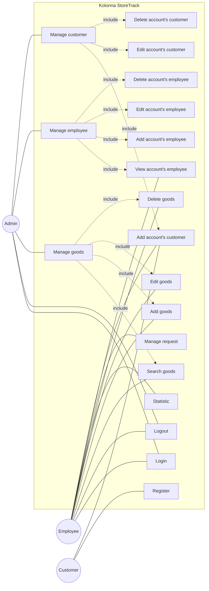
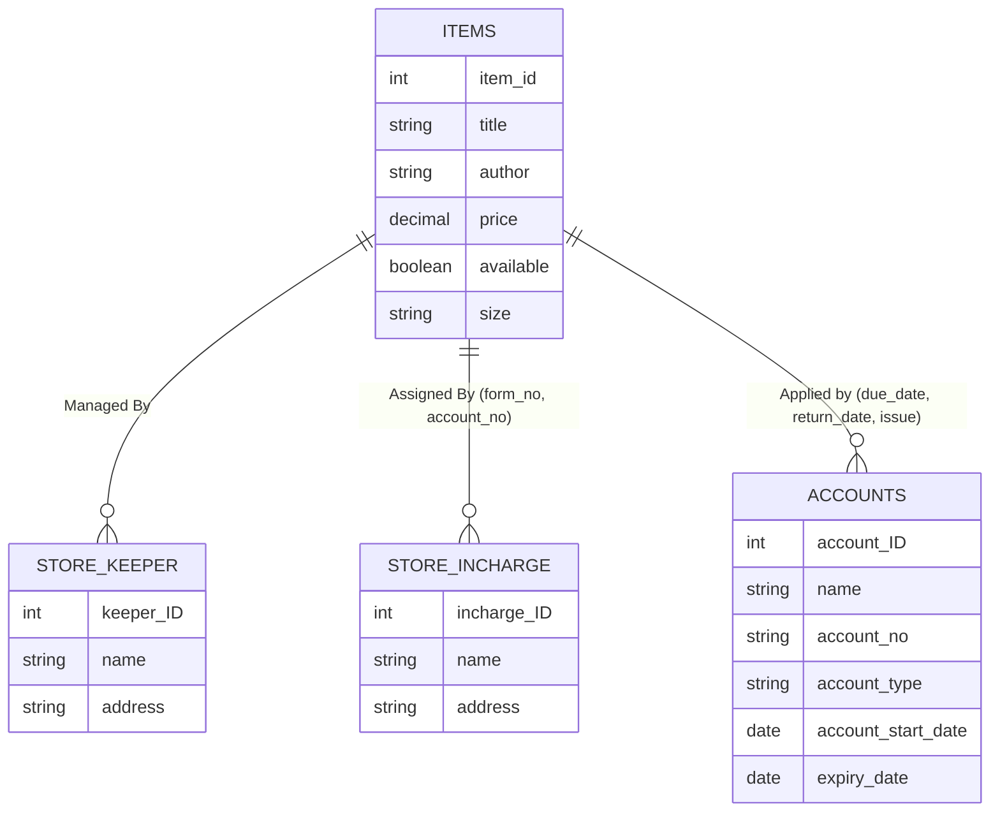

# IS5109 – IS Project for Community

**Kolonna StoreTrack**
Development of a Store Management System for the Kolonna Divisional Secretariat

**Group 18**
Department of Computing & Information Systems
Faculty of Computing
Sabaragamuwa University of Sri Lanka
September - 2025

---

## Approval of Community Project

| Index Number | Name with Initials | Email | Mobile No |
|---|---|---|---|
| 21CIS0082 | U.K.K.N.W. Gunathilaka | ukknwgunathilaka@std.foc.sab.ac.lk | 0765420582 |
| 21CIS0114 | W.M.M. Wijekoon | wmmwijekoon@std.foc.sab.ac.lk | 0743587327 |
| 21CIS0132 | N.M.Y.D. Gimhana | nmydgimhana@std.foc.sab.ac.lk | 0766287531 |
| 21CIS0133 | H.M.S.V. Hettiarachchi | hmsvhettiarachchi@std.foc.sab.ac.lk | 0754176685 |
| 21CIS0140 | A.W.U.I. Withanage | awuiwithanage@std.foc.sab.ac.lk | 0701987390 |
| 21CIS0213 | D.B.K. Jayathunga | dbkjayathunga@std.foc.sab.ac.lk | 0765746005 |

1. **Title of the Project:** Kolonna StoreTrack
2. **Name of the Internal Supervisor:** Mrs. S. Adeeba
3. **Internal Supervisor's designation:** Lecturer (Probationary), Department of Computing and Information Systems, Faculty of Computing, Sabaragamuwa University of Sri Lanka

**For office use only:**
Approved/Not approved
Signature of the Supervisor: *(signed)*

---

## Table of Content

1. Acknowledgment .......................................................................... 4
2. Introduction and Objectives ............................................................. 5
3. Analysis .................................................................................. 6
   - 3.1 Feasibility Study ................................................................... 6
     - 3.1.1 Technical Feasibility ........................................................... 6
     - 3.1.2 Operational Feasibility ......................................................... 6
     - 3.1.3 Economic Feasibility ............................................................ 6
   - 3.2 Diagrams ............................................................................ 7
     - 3.2.1 Use Case Diagram ................................................................ 8
     - 3.2.2 ER Diagram ...................................................................... 9
4. Developing Environment .................................................................. 10
   - 4.1 Hardware requirements .............................................................. 10
   - 4.2 Software Requirements .............................................................. 10
   - 4.3 Technology requirements ............................................................ 11
5. Tables and Structure ..................................................................... 12
   - 5.1 Number of Modules .................................................................. 12
   - 5.2 Module Details ..................................................................... 12
6. Proposed System .......................................................................... 15
   - 6.1 Requirements ....................................................................... 15
     - 6.1.1 Functional Requirements ........................................................ 15
     - 6.1.2 Non-Functional Requirements .................................................... 17
     - 6.1.3 Security Requirements .......................................................... 18
   - 6.2 Uniqueness of the Product .......................................................... 18
   - 6.3 Methodology (Agile Methodology) .................................................... 19
7. Gantt Chart .............................................................................. 20
8. Cost Estimate ............................................................................ 20
9. Conclusion ............................................................................... 21
10. References ............................................................................... 22
11. Appendix ................................................................................. 23

---

## 1. Acknowledgment

We extend our heartfelt thanks to Prof. S. Vasanthapriyan, Dean of the Faculty of Computing, Sabaragamuwa University of Sri Lanka, for his continuous guidance and encouragement, which motivated us to stay focused and achieve our goals. We are also deeply thankful to Dr. L. S. Lekamge, Head of the Department of Computing and Information Systems, for her timely advice and insightful direction throughout this journey.

Our sincere appreciation goes to Mrs. K.G.L. Chathumini, Senior Lecturer (Probationary) and Coordinator of the Community Project, Department of Computing and Information Systems, Faculty of Computing, for her valuable guidance, encouragement, and support in ensuring the smooth progress of this project.

We wish to express our special gratitude to our internal supervisor, Mrs. S. Adeeba, Lecturer (Probationary), Department of Computing and Information Systems, for her continuous supervision, valuable advice, and constructive feedback, which greatly enhanced the quality and successful completion of this proposal.

We are also thankful to the Divisional Secretary Kolonna, Mrs. S.T. Priyanka Weerasingha, and Administrative Officer, Mrs. D.H.S. Damayanthi, for granting us approval to carry out this project and for their cooperation in making it a reality.

Finally, we acknowledge with gratitude the support of our lecturers, colleagues, friends, and family members who have directly or indirectly contributed to the success of this proposal.

Group18
Team Members

---

## 2. Introduction and Objectives

### 2.1 Introduction

The rapid advancement of information technology has provided organizations with powerful tools to streamline their operations and improve service delivery through the use of computerized systems. Government institutions, in particular, play a vital role in serving communities and therefore require efficient, transparent, and reliable management systems to handle their day-to-day operations effectively.

The Kolonna Divisional Secretariat is one such institution that carries out a wide range of administrative and operational activities. Among these responsibilities, the management of stores and inventories is especially important, as it directly supports the smooth functioning of the institution. However, traditional manual record-keeping and paperwork-based methods have often proven to be time-consuming, error-prone, and insufficient in addressing the increasing demands of modern governance.

To overcome these challenges, Group 18 of the Department of Computing and Information Systems, Faculty of Computing, Sabaragamuwa University of Sri Lanka, proposed the development of a Store Management System under the IS5109 IS Project for Community. This system is designed to automate and modernize store-related operations, ensure accuracy and transparency, and enhance efficiency in inventory tracking, request management, and report generation.

This project is not only a technological initiative but also a community-driven effort aimed at improving the quality of public service, supporting better decision-making processes, and promoting sustainable institutional practices.

### 2.2 Objectives

The primary objective of this project is to design and implement a Store Management System for the Kolonna Divisional Secretariat to improve the efficiency, accuracy, and transparency of store-related operations. The specific objectives are as follows:

- **Automate store operations** – Replace manual record-keeping with a computerized system to save time and minimize errors.
- **Efficient inventory management** – Track stock levels, item requests, and usage patterns in real time.
- **Request handling** – Provide a systematic way to manage and monitor item requests from staff members.
- **Report generation** – Generate accurate and timely reports to support decision-making and institutional planning.
- **Enhance transparency** – Ensure accountability in store management through clear and reliable records.
- **User-friendly system** – Develop an easy-to-use interface that can be effectively operated by staff with minimal training.
- **Community benefit** – Contribute to the improvement of public service delivery by strengthening internal processes at the Divisional Secretariat.
- **Sustainability** – Introduce a solution that can be maintained and extended to meet future needs of the institution.

---

## 3. Analysis

### 3.1 Feasibility Study

#### 3.1.1 Technical Feasibility

The Store Management System is technically feasible because it can be developed using widely available and reliable technologies. The project will utilize web-based development frameworks, relational databases for data storage, and secure authentication mechanisms for user access. The Kolonna Divisional Secretariat has the basic infrastructure, including computers and internet access, to support the system. Furthermore, the development team will rely on open-source tools and platforms, ensuring flexibility and reducing software licensing costs. Since the system requirements are not highly complex, implementation can be achieved with the available resources and skills.

#### 3.1.2 Operational Feasibility

The proposed system will simplify existing manual processes, making it easier for staff to manage inventory, track item requests, and generate reports. The system will be user-friendly, requiring minimal training for staff members. By reducing paperwork, eliminating repetitive tasks, and ensuring real-time access to information, the system will significantly improve efficiency. Additionally, better transparency and accountability in store management will encourage staff to adopt the new system willingly.

#### 3.1.3 Economic Feasibility

From a cost perspective, the project is highly feasible. Since this is a community project carried out by university students, the development cost is minimal. The use of open-source technologies will further reduce expenses related to software. Although a small investment may be required for minor upgrades or maintenance, the long-term savings from reduced administrative workload, fewer errors, and improved resource management will outweigh any initial costs. Therefore, the system is economically beneficial for the institution.

### 3.2 Diagrams

#### 3.2.1 UML Use Case Diagram

> Actors: **Admin**, **Employee**, **Customer**

*(Reconstructed from the original UML use case diagram image in the proposal, section 3.2.1, page 8.)*

#### 3.2.2 ER Diagram

> Entities: **Items**, **Store Keeper**, **Store Incharge**, **Accounts**, with relationship sets **Managed By**, **Assigned By**, **Applied by**

*(Reconstructed from the original ER diagram image in the proposal, section 3.2.2, page 9. Note: this diagram's field set — Author, Title, Issue/Return/Due dates — does not match the functional requirements text in §6.1.1, which describes a generic office inventory rather than a library-style catalog; likely a template carried over from a different project.)*

---

## 4. Developing Environment

### 4.1 Hardware requirements

The development and deployment of the Store Management System require basic hardware resources. Since the system is lightweight, it does not demand high-end infrastructure.

**For Development Team:**
- Personal Computers/Laptops with minimum specifications:
  - Processor: Intel i5 or equivalent
  - RAM: 8 GB or higher
  - Storage: 256 GB SSD or higher
  - Display: 14-inch or above, Full HD recommended

**For Deployment at Secretariat:**
- Desktop Computer(s) for store staff and administrators
  - Processor: Intel i3 or higher
  - RAM: 4 GB or higher
  - Storage: 128 GB SSD/HDD
  - Printer (for report printing)
- Stable internet connection (for synchronization and updates)

### 4.2. Software Requirements

- **Operating System:** Windows 10/11 or Linux or Mac
- **Database Management System:** MySQL / PostgreSQL
- **Backend Development:** Python, Node.js
- **Frontend Development:** React.js
- **IDE/Code Editor:** Visual Studio Code / PyCharm
- **Version Control:** Git with GitHub for repository management
- **Browser:** Google Chrome / Mozilla Firefox (for system usage)

### 4.3 Technology requirements

**Programming Languages:**
- Python / JavaScript (for backend and frontend development)
- SQL (for database queries)

**Frameworks and Libraries:**
- React.js (frontend)
- FastAPI/Django (backend)
- Bootstrap/Tailwind CSS (UI design)

**Other Tools:**
1. GitHub (version control & collaboration)
2. Docker (optional – for containerization and deployment)
3. Report generation tools (PDF/Excel libraries)

---

## 5. Tables and Structure

### 5.1 Number of Modules

The system will be divided into **five main modules** to cover all functional requirements:

1. User Management Module
2. Inventory Management Module
3. Request Management Module
4. Transaction & Supplier Management Module
5. Reporting Module

### 5.2 Module Details

**1. User Management Module**
- Handles user registration, authentication, and role-based access.
- Ensures that only authorized staff can manage store operations.

**2. Inventory Management Module**
- Adds, updates, and deletes item records.
- Tracks available stock, reorder levels, and item categories.

**3. Request Management Module**
- Allows staff to request items from the store.
- Admin can approve, reject, or fulfill requests.
- Tracks request history and status.

**4. Transaction & Supplier Management Module**
- Logs all stock transactions (received/issued items).
- Manages supplier details for easy procurement.

### 5.3 Reporting Module
- Generates real-time reports on stock levels, requests, and transactions.
- Provides printable/exportable reports (PDF/Excel) for administrative use.

---

## 6 Proposed System

### 6.1 Requirements

#### 6.1.1 Functional Requirements

The system must be able to:

1. Manage user accounts with role-based access (Admin/Staff).
2. Add, update, and delete inventory items.
3. Track available stock levels and reorder points.
4. Handle requests for items from staff members.
5. Approve, reject, or fulfill item requests.
6. Record all stock transactions (received and issued items).
7. Manage supplier information for procurement.
8. Generate real-time reports (inventory, requests, and transactions).
9. Provide search and filter options for easy data retrieval.

#### 6.1.2 Non-Functional Requirements

- **Usability:** The interface should be simple, user-friendly, and require minimal training.
- **Performance:** The system should respond to user actions within 2–3 seconds.
- **Scalability:** The system should allow future enhancements (e.g., integration with financial modules).
- **Reliability:** The system must be available during working hours with minimal downtime.
- **Maintainability:** Code and database structures should be modular for easy updates.
- **Compatibility:** The system should run on standard web browsers (Chrome, Firefox, Edge).

#### 6.1.3 Security Requirements

- Role-based access control to ensure only authorized users can access sensitive data.
- Password encryption for secure authentication.
- Regular backups of the database to prevent data loss.
- Session management with auto-logout after inactivity.
- Secure communication using HTTPS to prevent unauthorized access.

### 6.2 Uniqueness of the Product

- Unlike generic inventory systems, this solution is tailor-made for the Kolonna Divisional Secretariat, addressing specific workflow needs.
- Designed with a community-driven approach by university students, ensuring cost-effectiveness.
- Focuses on simplicity and adaptability, making it suitable for staff with limited IT expertise.
- Provides real-time reporting and transparency, which are not available in manual or paper-based systems.

### 6.3 Methodology (Agile Methodology)

For the development of the **Store Management System** for the Kolonna Divisional Secretariat, our team adopted the **Agile Methodology**. Agile is an iterative and flexible approach to software development that emphasizes collaboration, customer feedback, and rapid delivery of functional modules. This methodology allows us to respond quickly to changing requirements and ensures that the system meets the real needs of the Secretariat staff.

**Key Features of Agile for This Project:**

1. **Iterative Development**
   - The system was developed in multiple sprints, each focusing on completing a specific module (e.g., User Management, Inventory Management).
   - Each sprint produced a working part of the system that could be tested and reviewed.
2. **Stakeholder Collaboration**
   - Regular feedback was gathered from the Secretariat staff and internal supervisors.
   - Adjustments were made promptly to align the system with actual operational needs.
3. **Flexibility**
   - Changes in functional requirements, such as additional reporting features or request tracking improvements, were incorporated efficiently without disrupting the overall project timeline.
4. **Team Communication**
   - Daily meetings and progress discussions helped track development, resolve issues quickly, and maintain coordination among team members.
5. **Continuous Testing and Quality Assurance**
   - Each module underwent unit testing and integration testing within its sprint to detect and fix defects early.
   - This ensured that the system remained stable and reliable throughout the development process.

**Agile Process Followed:**

1. **Requirement Analysis** – High-level system requirements were collected from the Secretariat staff and internal supervisors.
2. **Sprint Planning** – Tasks were prioritized, and sprints were defined to deliver functional modules in manageable iterations.
3. **Development & Testing** – Modules were implemented and tested within each sprint cycle. Feedback was incorporated immediately to improve functionality and usability.
4. **Review & Feedback** – Completed modules were presented to mentors and staff for review. Adjustments were made based on their input before starting the next sprint.
5. **Deployment** – After completing all sprints, the fully integrated system was deployed for use at the Kolonna Divisional Secretariat.

**Benefits for This Project:**
- Faster delivery of working modules.
- Enhanced adaptability to changing operational needs.
- Improved transparency and efficiency in store management.
- Increased engagement and satisfaction of staff members through continuous feedback.

---

## 7 Gantt Chart

**Kolonna StoreTrack**

| Task | Week 1 | Week 2 | Week 3 | Week 4 | Week 5 | Week 6 | Week 8 | Week 10 |
|---|---|---|---|---|---|---|---|---|
| Requirement Analysis | ▓ | | | | | | | |
| Sprint Planning | | ▓ | | | | | | |
| User Management Module | | | ▓ | | | | | |
| Inventory Management Module | | | | ▓ | | | | |
| Request Management Module | | | | | ▓ | | | |
| Transaction & Supplier Module | | | | | | ▓ | | |
| Reporting Module | | | | | | | ▓ | |
| Integration & Testing | | | | | | | | ▓ |
| Deployment & Documentation | | | | | | | | |

---

## 8. Cost Estimate

| Item | Estimated Cost (LKR) |
|---|---|
| Hosting Cost | Rs 5000.00 |
| Domain registration | Rs 2500.00 |

---

## 9 References

1. R. S. Pressman, *Software Engineering: A Practitioner's Approach*, 8th ed. New York, NY, USA: McGraw-Hill, 2014.
2. I. Sommerville, *Software Engineering*, 10th ed. Pearson, 2016.
3. S. W. Ambler, *Agile Modeling: Effective Practices for Extreme Programming and the Unified Process*. Wiley, 2002.
4. K. C. Laudon and J. P. Laudon, *Management Information Systems: Managing the Digital Firm*, 16th ed. Pearson, 2020.
5. Kolonna Divisional Secretariat, "Official Documents and Records for Inventory and Store Management," Kolonna, Ratnapura District, Sabaragamuwa Province, Sri Lanka, 2025.
6. E. Gamma, R. Helm, R. Johnson, and J. Vlissides, *Design Patterns: Elements of Reusable Object-Oriented Software*. Addison-Wesley Professional, 1994.
7. MySQL Documentation, *MySQL 8.0 Reference Manual*, Oracle Corporation, 2025. [Online]. Available: https://dev.mysql.com/doc/
8. React Documentation, *React – A JavaScript Library for Building User Interfaces*, 2025. [Online]. Available: https://reactjs.org/docs/getting-started.html
9. FastAPI Documentation, *FastAPI – Modern, Fast (high-performance), Web Framework*, 2025. [Online]. Available: https://fastapi.tiangolo.com/
10. Sabaragamuwa University of Sri Lanka, *IS5109 – IS Project for Community: Project Guidelines*, Faculty of Computing, 2025.

---

## 10 Appendix

### Approval Letter from Kolonna Divisional Secretariat

> *Divisional Secretariat – Kolonna*
> Web: www.kolonna.ds.gov.lk | Email: Moba.divi.kolonna@gmail.com
> My No: KOLDS/ADM/CM/011 | Your No: — | Date: 2025.09.26

**Subject: Approval for the Project – Development of a Store Management System for the Kolonna Divisional Secretariat (IS5109 – IS Project for Community)**

> The above matter is related to the letter dated 25.09.2025.
>
> 2. Accordingly, we are pleased to inform you that the Community Project submitted by Group 18 of the Department of Computing and Information Systems has been duly considered.
>
> 3. The Kolonna Divisional Secretariat sincerely appreciates the initiative demonstrated by the students in selecting our institution for their Community Project. We recognize that the proposed Store Management System, designed to streamline inventory management, track item requests, monitor stock levels, and generate reports, represents a timely and innovative solution that will enhance operational efficiency and contribute significantly to the effective management of our institutional resources.
>
> 4. Accordingly, the Kolonna Divisional Secretariat hereby grants approval for the students to execute this project in collaboration with our staff. We further assure our fullest support and cooperation to ensure the successful implementation and completion of the project.

Signed by:
**D.H.S. Damayanthi** — Administrative Officer
**S.T. Priyanka Weerasingha** — Divisional Secretary, Kolonna

*"Our Service for you – Your Service for the Country"*

Divisional Secretary: 045 22 60 162 | Office: 045 22 60 238 | Fax: 045 22 60 237
