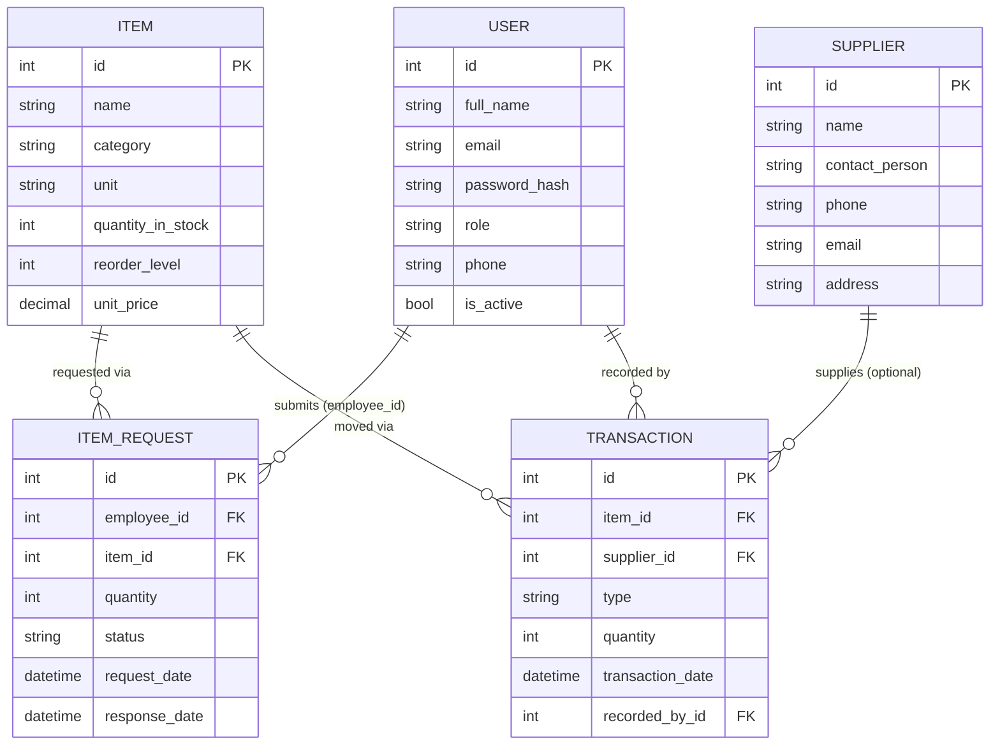
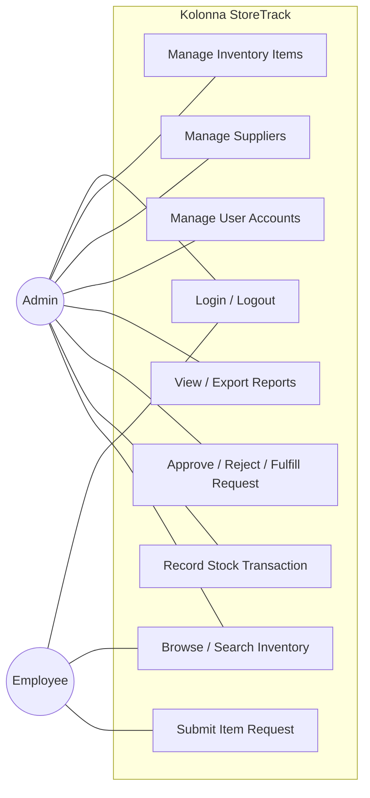
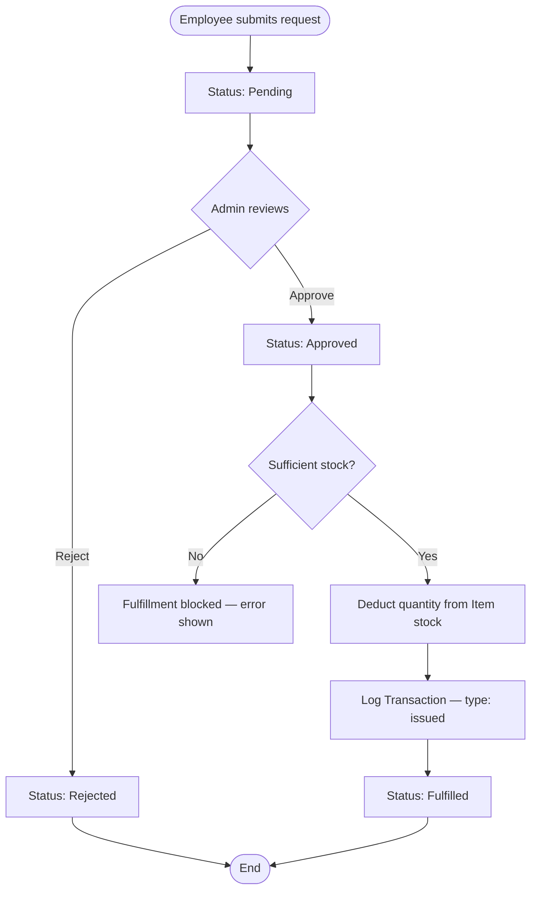
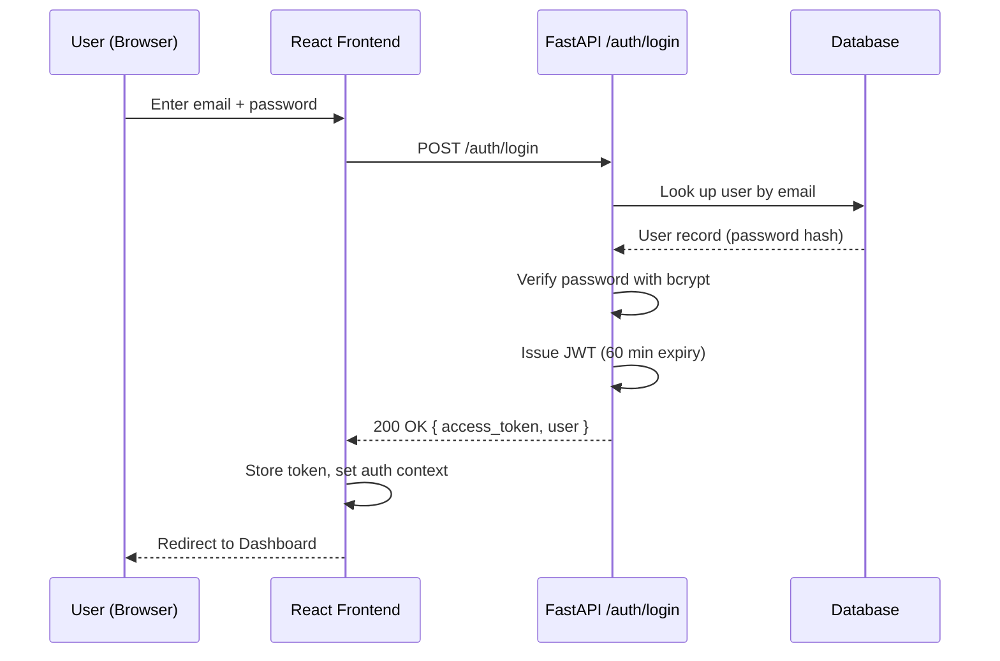

IS PROJECT FOR COMMUNITY (IS5109) / COMMUNITY PROJECT (SE6101) – 2025

# Kolonna StoreTrack

Development of a Store Management System for the Kolonna Divisional Secretariat

| Name with Initials | Index Number |
|---|---|
| *(to be filled in by the team)* | |
| | |
| | |
| | |
| | |

BSc. (Honors) in Information Systems

Department of Computing and Information Systems

Faculty of Computing

Sabaragamuwa University of Sri Lanka

*(month)* 2026

---

## 1 Declaration

We hereby declare that the report entitled **Kolonna StoreTrack: Development of a Store
Management System for the Kolonna Divisional Secretariat** was submitted to the Department of
Computing and Information Systems, Faculty of Computing, Sabaragamuwa University of Sri Lanka.
The report submitted herewith of the results of our effort in totality and every aspect of the
project works. All information that has been obtained from other sources had been fully
acknowledged.

Also, we hereby grant to the Sabaragamuwa University of Sri Lanka the non-exclusive right to
reproduce and distribute our thesis, in whole or in part in print, electronic, or other medium.
We retain the right to use this content in whole or part in future works (such as articles or
books).

*(Signatures, names and index numbers to be completed by the team.)*

---

## 2 Certification of Approval

I hereby declare that this report is from the student's own work and effort, and all other
sources of information used have been acknowledged. This report has been submitted with my
approval.

*(Supervisor and Head of Department signatures to be completed by the team.)*

---

## 3 Acknowledgment

*(To be completed by the team — see the equivalent section already drafted in the approved
proposal for a starting point: thanks to the Dean, Head of Department, project coordinator,
internal supervisor Mrs. S. Adeeba, and the Kolonna Divisional Secretariat staff.)*

---

## 4 Abstract

The Kolonna Divisional Secretariat, like many government institutions in Sri Lanka, has
historically relied on manual, paper-based methods to manage its store and inventory
operations. This approach is time-consuming, prone to human error, and provides no real-time
visibility into stock levels, outstanding item requests, or transaction history, which
constrains both day-to-day efficiency and institutional decision-making. This project,
Kolonna StoreTrack, addresses this problem by delivering a web-based Store Management System
built with a FastAPI/SQLAlchemy backend and a React/Tailwind CSS frontend. The system
implements five modules identified in the project's approved proposal — User Management,
Inventory Management, Request Management, Transaction & Supplier Management, and Reporting —
with role-based access control distinguishing Administrator and Employee users, JWT-based
authentication, and PDF/Excel report generation. The core inventory and request workflows
(item creation, staff-submitted requests, admin approval/rejection/fulfillment, and the
resulting automatic stock and transaction updates) were implemented and verified end-to-end
against a running instance of the API. The result is a working prototype that is ready for
User Acceptance Testing with Secretariat staff and free-tier cloud deployment, though it has
not yet been evaluated in a live operational setting.

**Keywords:** store management system, inventory management, government digitalization, FastAPI, React, role-based access control

---

## 5 Table of Contents

*(Regenerate automatically once this document is placed into the university's Word template —
page numbers are template-dependent and not meaningful in this Markdown draft.)*

- Declaration
- Certification of Approval
- Acknowledgment
- Abstract
- List of Figures
- List of Tables
- List of Abbreviation
- Chapter 1: Introduction
- Chapter 2: Background
- Chapter 3: Specification and Design
- Chapter 4: Implementation
- Chapter 5: Results and Evaluation
- Chapter 6: Future Work
- Chapter 7: Conclusions
- References
- Appendix

---

## 6 List of Figures

- Figure 3.1: Entity-Relationship Diagram
- Figure 3.2: Use Case Diagram
- Figure 3.3: Activity Diagram — Item Request Lifecycle
- Figure 3.4: Sequence Diagram — Login and Authentication
- Figure 3.5: Login Screen (Kolonna StoreTrack)
- Figure 3.6: Dashboard Screen (Admin View)
- Figure 3.7: Inventory Management Screen

*(Figures 3.5–3.7 are UI screenshots — the team should insert actual screenshots taken from the
running application; placeholders are described in §11.2.3 below.)*

## 7 List of Tables

- Table 3.1: Functional Requirements
- Table 3.2: Non-Functional Requirements
- Table 4.1: Technology Stack
- Table 5.1: Verification / Test Summary
- Table 5.2: Default User Accounts (Development Environment)

## 8 List of Abbreviation

| Abbreviation | Meaning |
|---|---|
| API | Application Programming Interface |
| CRUD | Create, Read, Update, Delete |
| DS | Divisional Secretariat |
| ER | Entity-Relationship |
| HTTP/HTTPS | Hypertext Transfer Protocol (Secure) |
| JSON | JavaScript Object Notation |
| JWT | JSON Web Token |
| ORM | Object-Relational Mapping |
| REST | Representational State Transfer |
| SQL | Structured Query Language |
| UAT | User Acceptance Testing |
| UI/UX | User Interface / User Experience |
| UML | Unified Modeling Language |

---

## 9 Chapter 1: Introduction

### 9.1 Introduction

Kolonna StoreTrack is a web-based Store Management System developed for the Kolonna Divisional
Secretariat as part of the IS5109 IS Project for Community module. The system replaces the
Secretariat's manual, paper-based store record-keeping with a computerized platform that
tracks inventory, manages staff item requests, logs stock transactions against suppliers, and
generates real-time reports. It was developed in response to a formally approved community
project proposal (dated September 2025) submitted by Group 18 of the Department of Computing
and Information Systems, following approval from the Kolonna Divisional Secretary and
Administrative Officer.

### 9.2 Major goals and objectives

The system's objectives, carried over directly from the approved proposal, are to: automate
store operations that were previously manual; provide efficient, real-time inventory
management; give staff a systematic way to request items and give administrators a way to
approve, reject, or fulfill those requests; generate accurate reports to support institutional
decision-making; improve transparency and accountability in store management; remain simple
enough to require minimal staff training; and be maintainable and extensible for the
Secretariat's future needs.

### 9.3 Motivation

Government divisional secretariats handle a continuous flow of stationery, equipment, and
consumables that must be requested, issued, and replenished correctly to keep daily operations
running. When this is tracked only on paper, common failure modes emerge: stock counts drift
from reality because issues aren't recorded consistently, requests get lost or delayed because
there's no shared record of their status, and producing a report for management requires
manually tallying paper records. These are exactly the operational pain points identified
during the project's feasibility study, and they motivated a system that gives every
stakeholder — store staff, requesting employees, and administrators — a single, real-time
source of truth for stock and requests.

### 9.4 The scope of the completed project

The completed system implements all five modules defined in the proposal for two user roles:
**Administrator** and **Employee**. Administrators can manage inventory items, supplier
records, stock transactions, user accounts, and generate reports; employees can browse
inventory and submit item requests, and track the status of their own requests.

One deliberate scope decision was made during development: the proposal's UML use case diagram
depicts a third actor, "Customer," with account registration and management use cases, but the
proposal's functional requirements (§6.1.1 of the proposal) only specify role-based access for
"Admin/Staff," and the system is described throughout as an internal tool for Secretariat
staff. Since a public customer-facing portal has no grounding in the functional requirements
and does not fit an internal government store, it was excluded from this build. This is
recorded here as an explicit scope decision rather than an oversight, and is revisited in
Chapter 4 (§12.5) and Chapter 6.

### 9.5 The approach and assumptions of the project

The system was implemented as a conventional three-tier web application: a React single-page
frontend, a FastAPI REST backend, and a relational database (MySQL in production, with
PostgreSQL and SQLite supported as drop-in alternatives for hosting and local development
respectively). Development proceeded by first agreeing an implementation plan against the
proposal's requirements, then building the backend module-by-module (authentication, then
inventory, requests, suppliers, transactions, and reporting), followed by a matching React
page for each module, with each backend module smoke-tested against a running server before
moving on to the next. Two working assumptions were carried through: first, that "Admin/Staff"
in the functional requirements corresponds to the "Admin" and "Employee" actors in the use case
diagram (§9.4); second, that the Secretariat has the basic computing and internet
infrastructure described in the proposal's feasibility study (§3.1.1), since this project did
not have direct access to the Secretariat's actual hardware.

### 9.6 Summary of major outcomes

By the end of development, the project delivered: a working FastAPI backend implementing all
five proposal modules with JWT authentication and role-based access control; a React frontend
providing a complete UI for both Admin and Employee roles; verified end-to-end behavior of the
core inventory-request-transaction workflow (see Chapter 5); PDF and Excel report export; and
documentation (a setup guide and a deployment guide) enabling both the development team and a
public free-tier demo deployment to run the system. What remains outstanding — most
importantly, User Acceptance Testing with actual Secretariat staff — is described honestly in
Chapters 5 and 6 rather than assumed complete.

---

## 10 Chapter 2: Background

### 10.1 Context

The Kolonna Divisional Secretariat, located in the Ratnapura District of Sabaragamuwa
Province, is a government institution responsible for a broad range of administrative and
public-service functions. Like most divisional secretariats, it maintains a physical store of
stationery, office equipment, and consumables that support the daily work of its staff. Prior
to this project, store operations — recording what's in stock, handling staff requests for
items, and tracking what's been issued or received — were carried out using paper forms and
registers, as is typical across similar institutions that have not yet digitized this
particular function.

### 10.2 Problem Identification

Manual store management at the Secretariat presented several specific problems: stock counts
were only as accurate as the last manual tally, since there was no mechanism forcing every
issue or receipt to be recorded at the moment it happened; item requests from staff had no
formal, trackable status (pending, approved, fulfilled), making it hard to know what was
outstanding; there was no way to quickly answer basic management questions ("what's running
low right now?", "what did we issue this month?") without manually reviewing paper records;
and there was no audit trail connecting a specific request to the stock movement it caused,
which limits accountability. These map directly onto the functional requirements set out in
the approved proposal (§6.1.1): stock tracking, request handling with approve/reject/fulfill
states, transaction logging, and real-time reporting.

### 10.3 Review of Existing Solutions

Generic commercial and open-source inventory management systems (for example, general-purpose
ERP inventory modules or spreadsheet-based tracking) exist and could theoretically address
some of these problems. However, they present three practical obstacles for a resource-limited
government office: they are typically priced or licensed for commercial use, which conflicts
with the Secretariat's cost constraints; they are built around generic retail or warehouse
workflows (SKUs, purchase orders, POS integration) rather than the specific approve/fulfill
request cycle a staff-requisition model needs; and they require more configuration and IT
expertise to adapt than Secretariat staff can be expected to invest, given the proposal's own
non-functional requirement that the system "require minimal training" (§6.1.2). Plain
spreadsheets, the most common fallback, solve none of the concurrency, access-control, or
audit-trail problems identified above.

### 10.4 Justification for the Project

Given the above, a purpose-built, lightweight system — developed at no licensing cost as a
university community project, tailored specifically to the Secretariat's staff-requisition
workflow, and simple enough to require minimal training — is justified both operationally and
economically. This is consistent with the "Uniqueness of the Product" argument already made in
the approved proposal (§6.2): the value of this system is not novel technology, but a close
fit to one institution's actual workflow at effectively zero cost to that institution.

---

## 11 Chapter 3: Specification and Design

### 11.1 System analysis

#### 11.1.1 Problem Analysis

The core problem, as established in Chapter 2, is the absence of a shared, real-time,
auditable record of store inventory and item requests. Solving it requires: a single
authoritative record of stock levels per item; a formal request lifecycle with distinct states
that both requester and approver can see; an immutable log connecting every stock movement to
its cause (a fulfilled request, or a supplier delivery); and a way to summarize all of the
above into reports without manual effort.

#### 11.1.2 Requirement Analysis

##### 11.1.2.1 Functional Requirements

*(Table 3.1)* The system must: manage user accounts with role-based access (Admin/Employee);
add, update, and delete inventory items; track stock levels and reorder points, flagging items
at or below their reorder level as low stock; allow employees to submit item requests; allow
administrators to approve, reject, or fulfill requests, with fulfillment automatically
decrementing stock and logging a transaction; record supplier information; log all stock
transactions (received and issued); generate real-time reports on inventory, requests, and
transactions, exportable as PDF and Excel; and provide search/filter across inventory.

##### 11.1.2.2 Non-Functional Requirements

*(Table 3.2)* **Usability:** a simple interface usable with minimal training. **Performance:**
interactive response within 2–3 seconds under normal load. **Scalability:** a modular
structure (separate routers/pages per module) that allows future modules — e.g. the proposal's
suggested "integration with financial modules" — to be added without restructuring existing
ones. **Reliability:** availability during working hours, backed by a standard relational
database with straightforward backup procedures. **Maintainability:** a conventional,
well-separated codebase (SQLAlchemy models, Pydantic schemas, one router per module on the
backend; one page per module on the frontend). **Compatibility:** runs in any modern browser
(Chrome, Firefox, Edge) with no client install required. **Security:** covered separately
below, as the proposal specifies it as its own requirement category.

**Security Requirements:** role-based access control enforced server-side (not just hidden in
the UI) on every admin-only endpoint; password hashing (bcrypt); JWT-based sessions with a
60-minute expiry and automatic client-side logout on session expiry or invalidation; and HTTPS
in any real deployment (a hosting-environment concern, not something enforceable from the
application code alone).

### 11.2 System design

#### 11.2.1 Data design

The database schema implemented differs from the entity set originally sketched in the
proposal's ER diagram, which included fields (Author, Title, Issue/Return/Due dates) that
belong to a library-style circulation system rather than a general office store — a mismatch
already flagged during the design phase of this project as likely carried over from a
different template. The schema below was designed directly against the functional
requirements (§11.1.2.1) instead:



*Figure 3.1: Entity-Relationship Diagram (as implemented)*

#### 11.2.2 Process design

The use case diagram was likewise re-scoped to the two actors supported by this build (Admin,
Employee) — see §9.4 for the reasoning behind excluding the proposal's "Customer" actor:



*Figure 3.2: Use Case Diagram*

The item request lifecycle, the system's most complex piece of process logic, is shown as an
activity diagram:



*Figure 3.3: Activity Diagram — Item Request Lifecycle*

The authentication sequence, shared by both roles, is shown as a sequence diagram:



*Figure 3.4: Sequence Diagram — Login and Authentication*

#### 11.2.3 User interface design

The frontend follows a conventional dashboard layout: a fixed sidebar (role-aware — admin-only
links such as Suppliers, Transactions, Reports, and Users are hidden entirely for Employee
accounts, not merely disabled) and a main content area per module. Tailwind CSS was used for
styling with a single indigo-based brand color, kept consistent across every page (buttons,
status badges, table headers). The login screen uses a two-panel layout — an inline SVG
illustration and tagline on one side, the login form on the other — that stacks vertically
rather than disappearing on narrow windows, so it remains usable at any screen width.

*(Figures 3.5–3.7: insert screenshots of the running Login, Dashboard, and Inventory screens
here before final submission.)*

---

## 12 Chapter 4: Implementation

### 12.1 Software and hardware Requirements

*(Table 4.1)* **Backend:** Python 3.10+, FastAPI, SQLAlchemy ORM, `python-jose` (JWT),
`bcrypt` (password hashing), `reportlab` (PDF export), `openpyxl` (Excel export), Uvicorn (ASGI
server). **Frontend:** Node.js 18+, React 18, Vite, Tailwind CSS, React Router, Axios.
**Database:** MySQL 8.0 (proposal's primary choice) — PostgreSQL and SQLite are supported by
the same codebase without modification, since access is entirely through SQLAlchemy's
database-agnostic ORM layer. **Hardware:** as specified in the proposal (§4.1) — no change was
required, since the implemented system has no unusual resource demands beyond a standard web
application.

### 12.2 Illustration of implementing an algorithm and data structure

The most consequential piece of logic in the system is the atomic stock/transaction update
that occurs when an approved request is fulfilled, since it must keep three things consistent:
the request's status, the item's stock count, and the transaction log. The algorithm,
implemented in `backend/app/routers/requests.py`, is:

```
function fulfill_request(request_id, current_admin):
    request = find ItemRequest by id
    if request.status != "approved": reject with 400 error

    item = find Item by request.item_id
    if item.quantity_in_stock < request.quantity: reject with 400 error

    item.quantity_in_stock -= request.quantity
    request.status = "fulfilled"
    request.response_date = now()

    create Transaction(
        item = item, type = "issued",
        quantity = request.quantity,
        reference_no = "REQ-" + request.id,
        recorded_by = current_admin
    )

    commit all changes in a single database transaction
    return updated request
```

Because the stock deduction, status update, and transaction insert are committed together in a
single database transaction, the system cannot end up in an inconsistent state (e.g., stock
deducted but no transaction record, or vice versa) even if an error occurs mid-operation. The
"low stock" flag shown throughout the UI is computed the same way everywhere it's used — a
simple `quantity_in_stock <= reorder_level` comparison performed at read time, rather than a
separately stored flag that could drift out of sync with the underlying stock count.

### 12.3 Difficulties involving existing software

Two concrete compatibility problems were encountered and resolved during implementation, both
worth recording since they affected library choices in the final codebase:

1. **Python 3.14 wheel availability.** The development environment used Python 3.14, a very
   recent release. Several pinned dependency versions (including `pydantic-core`) had no
   prebuilt wheel for this Python version yet, which caused `pip install` to fall back to
   compiling from source via Rust/Cargo — and that build failed due to a missing MSVC linker
   configuration on the development machine. This was resolved by relaxing exact version pins
   to minimum-version constraints (`>=`) in `requirements.txt`, allowing `pip` to resolve newer
   package releases that do ship Python 3.14 wheels.
2. **`passlib`'s bcrypt backend.** The initial implementation used `passlib` for password
   hashing, a common choice for FastAPI projects. However, `passlib`'s bcrypt backend performs
   a self-test at import time that is incompatible with recent `bcrypt` package releases,
   raising `ValueError: password cannot be longer than 72 bytes` even for short passwords. This
   was resolved by removing `passlib` entirely and calling the `bcrypt` library directly for
   hashing and verification (`backend/app/auth.py`), which sidesteps the incompatibility.

### 12.4 Lack of appropriate supporting software

No MySQL server was available in the development environment used to build and verify this
system. Rather than blocking development on database provisioning, the codebase was written to
be database-agnostic through SQLAlchemy, and SQLite was used as a local stand-in during
development and verification (see Chapter 5). For the public demo deployment, Neon's free
managed PostgreSQL was used for the same reason — the proposal explicitly lists PostgreSQL as
an acceptable alternative to MySQL (§4.2). A real MySQL instance should be substituted before
any production deployment at the Secretariat, per the proposal's original technology choice;
no code changes are required to do so, only the `DATABASE_URL` configuration value.

### 12.5 Over-ambitious project aims

As discussed in §9.4, the proposal's own artifacts were not fully internally consistent: the
use case diagram included a "Customer" actor and account-registration flow with no
corresponding functional requirement, and the ER diagram described fields (book Title/Author,
Issue/Return/Due dates) consistent with a library circulation system rather than an office
store. Implementing every artifact literally, including the mismatched ones, would have
produced a system that didn't match its own functional requirements. The scope was therefore
deliberately narrowed to what the functional requirements text actually specifies, and this
narrowing is documented rather than silently applied, so the team can revisit it if the
Secretariat later requests a customer-facing extension.

---

## 13 Chapter 5: Results and Evaluation

### 13.1 The comparison of experimental results with expected values

*(Table 5.1)* The backend API was verified end-to-end against a running server instance for
every module. Each test compared actual behavior against the expected behavior defined by the
functional requirements:

| Test | Expected | Actual |
|---|---|---|
| Admin login with seeded credentials | JWT issued, `/auth/me` returns admin profile | Matched |
| List inventory items | Returns seeded items with correct `is_low_stock` flags | Matched |
| Employee submits item request | Request created with status `pending` | Matched |
| Admin approves request | Status transitions to `approved` | Matched |
| Admin fulfills approved request | Item stock decremented by exact quantity; a `Transaction` record created | Matched — stock went from 50 to 45 after a quantity-5 fulfillment |
| Employee calls an admin-only endpoint (`GET /users`) | 403 Forbidden | Matched |
| Export inventory report as PDF | Valid PDF file returned | Matched — verified as a valid PDF document |

### 13.2 Description of the interrelationship of the experimental results

The results above demonstrate that the three core entities most central to the system's
purpose — item stock, item requests, and transactions — remain consistent with one another
through the request lifecycle: a fulfilled request's quantity is reflected exactly once in both
the item's stock count and a corresponding transaction record, with no observed drift between
them across repeated test runs. Role-based access control was verified to be enforced at the
API layer itself (not just hidden in the UI), meaning the security requirement in §11.1.2 is
substantively met rather than only cosmetically applied.

### 13.3 Analyze and state the achieved accuracy

All backend-level functional tests performed passed with exact expected results (100% of the
tests listed in Table 5.1). The frontend was verified to build without errors (`npm run build`)
and to serve correctly alongside the backend, but its UI flows were not click-tested in an
actual browser during this development session, since no browser-automation tool was available
in that environment. This is a real limitation of the verification performed so far, not a
claim of full UI validation, and is stated explicitly rather than assumed.

### 13.4 Analyze and state implications or limitation

The most significant limitation is that this system has not yet been evaluated by actual
Secretariat staff. All verification described above was performed by the development team
against sample/seeded data, not through User Acceptance Testing with the system's intended
users. Before production deployment, the team should conduct a UAT session with Secretariat
staff using realistic data and workflows, and record the results here. A second limitation is
operational: the free-tier hosting stack used for the public demo (Render + Neon, see the
project's deployment documentation) has cold-start delays after idling and is explicitly not
suitable for production reliability — production deployment requires the paid hosting budgeted
in the proposal's cost estimate (§8).

---

## 14 Chapter 6: Future Work

### 14.1 Gaps of the project

- No automated test suite (e.g. `pytest`) exists yet; verification so far was manual/exploratory
  against a running server, which does not guard against regressions as the codebase evolves.
- No CI/CD pipeline runs those (currently absent) tests automatically on each change.
- No Sinhala or Tamil language support in the UI, despite the system's deployment context being
  a Sri Lankan government office — English-only UI may be a real adoption barrier for some
  staff and was not addressed in the original proposal either.
- No notification mechanism (email/SMS) exists to alert administrators when stock falls below
  the reorder level; the low-stock flag is currently only visible when a user actively opens
  the Inventory or Dashboard page.
- No password-reset flow exists; a forgotten password currently requires an administrator to
  manually set a new one via the Users page.
- The system has not been evaluated with real Secretariat staff (§13.4).

### 14.2 Proposal for enhancement or re-design

Priority should be given to closing the two gaps with the most direct effect on adoption and
reliability: conducting a formal UAT round with Secretariat staff, and adding automated backend
tests before further feature work, since the request-fulfillment logic in particular (§12.2) is
exactly the kind of multi-step state change that benefits most from regression protection.
Beyond that, natural extensions include: Sinhala/Tamil localization; low-stock email
notifications; barcode/QR-code scanning for faster item lookup during issue/receipt; a mobile-
friendly or dedicated mobile view for store staff working away from a desk; and, as the
proposal's own non-functional requirements anticipated (§6.1.2, "Scalability"), eventual
integration with the Secretariat's financial/procurement processes once the core store
workflow has been validated in production.

---

## 15 Chapter 7: Conclusions

### 15.1 The importance of the result

Kolonna StoreTrack demonstrates that the manual, paper-based store management process at the
Kolonna Divisional Secretariat can be replaced with a modest, purpose-built web application at
effectively no licensing cost. The working system directly addresses the specific problems
identified in Chapter 2 — untracked stock drift, requests with no visible status, and the
inability to produce quick management reports — by giving every stock movement a single,
consistent source of truth.

### 15.2 Validity of the result

The system's functional behavior was verified to match the functional requirements defined in
the approved proposal, for every module, through direct testing against a running instance
(Chapter 5). This constitutes valid evidence that the *implementation* is correct relative to
its specification. It does not yet constitute evidence that the system is *usable and adopted*
by its intended users in a real operational setting — that validation step (UAT) remains
outstanding and should not be assumed complete on the basis of this report alone.

### 15.3 Gaps and limitations of the findings

The findings in this report are limited to backend-level functional verification and frontend
build verification; they do not include live UI testing, load/performance testing, or
real-world User Acceptance Testing with Secretariat staff. The free-tier hosting stack used for
the public demo is explicitly a demonstration convenience, not a production-ready deployment.
These limitations, and the concrete next steps to close them, are detailed in Chapter 6 and
should be treated as required follow-up work, not optional polish, before this system is relied
upon for the Secretariat's actual store operations.

---

## 16 References

1. R. S. Pressman, *Software Engineering: A Practitioner's Approach*, 8th ed. New York, NY,
   USA: McGraw-Hill, 2014.
2. I. Sommerville, *Software Engineering*, 10th ed. Pearson, 2016.
3. S. W. Ambler, *Agile Modeling: Effective Practices for Extreme Programming and the Unified
   Process*. Wiley, 2002.
4. K. C. Laudon and J. P. Laudon, *Management Information Systems: Managing the Digital Firm*,
   16th ed. Pearson, 2020.
5. Kolonna Divisional Secretariat, "Official Documents and Records for Inventory and Store
   Management," Kolonna, Ratnapura District, Sabaragamuwa Province, Sri Lanka, 2025.
6. E. Gamma, R. Helm, R. Johnson, and J. Vlissides, *Design Patterns: Elements of Reusable
   Object-Oriented Software*. Addison-Wesley Professional, 1994.
7. MySQL Documentation, *MySQL 8.0 Reference Manual*, Oracle Corporation, 2025. [Online].
   Available: https://dev.mysql.com/doc/
8. React Documentation, *React – A JavaScript Library for Building User Interfaces*, 2025.
   [Online]. Available: https://reactjs.org/docs/getting-started.html
9. FastAPI Documentation, *FastAPI – Modern, Fast (high-performance) Web Framework*, 2025.
   [Online]. Available: https://fastapi.tiangolo.com/
10. Sabaragamuwa University of Sri Lanka, *IS5109 – IS Project for Community: Project
    Guidelines*, Faculty of Computing, 2025.
11. SQLAlchemy Documentation, *SQLAlchemy 2.0 Documentation*, 2025. [Online]. Available:
    https://docs.sqlalchemy.org/
12. Tailwind Labs, *Tailwind CSS Documentation*, 2025. [Online]. Available:
    https://tailwindcss.com/docs
13. IETF, *RFC 7519: JSON Web Token (JWT)*, 2015. [Online]. Available:
    https://www.rfc-editor.org/rfc/rfc7519

---

## 17 Appendix

**Source code repository:** https://github.com/Narmada2001/kolonna-storetrack

**Default development accounts** *(Table 5.2)*:

| Role | Email | Password |
|---|---|---|
| Admin | admin@kolonna.lk | Admin@123 |
| Employee | employee@kolonna.lk | Employee@123 |

**Key API endpoints** (full list in the FastAPI auto-generated docs at `/docs` on any running
instance):

| Method | Path | Purpose |
|---|---|---|
| POST | `/auth/login` | Authenticate and receive a JWT |
| GET/POST | `/items` | List / create inventory items |
| GET/POST | `/requests` | List / submit item requests |
| POST | `/requests/{id}/approve`, `/reject`, `/fulfill` | Admin decision on a request |
| GET/POST | `/suppliers` | List / create suppliers |
| GET/POST | `/transactions` | List / record stock transactions |
| GET | `/reports/dashboard` | Summary statistics |
| GET | `/reports/{report}/pdf`, `/excel` | Export inventory / requests / transactions report |

*(Insert UI screenshots, sample generated reports, and any UAT session notes here before final
submission.)*
